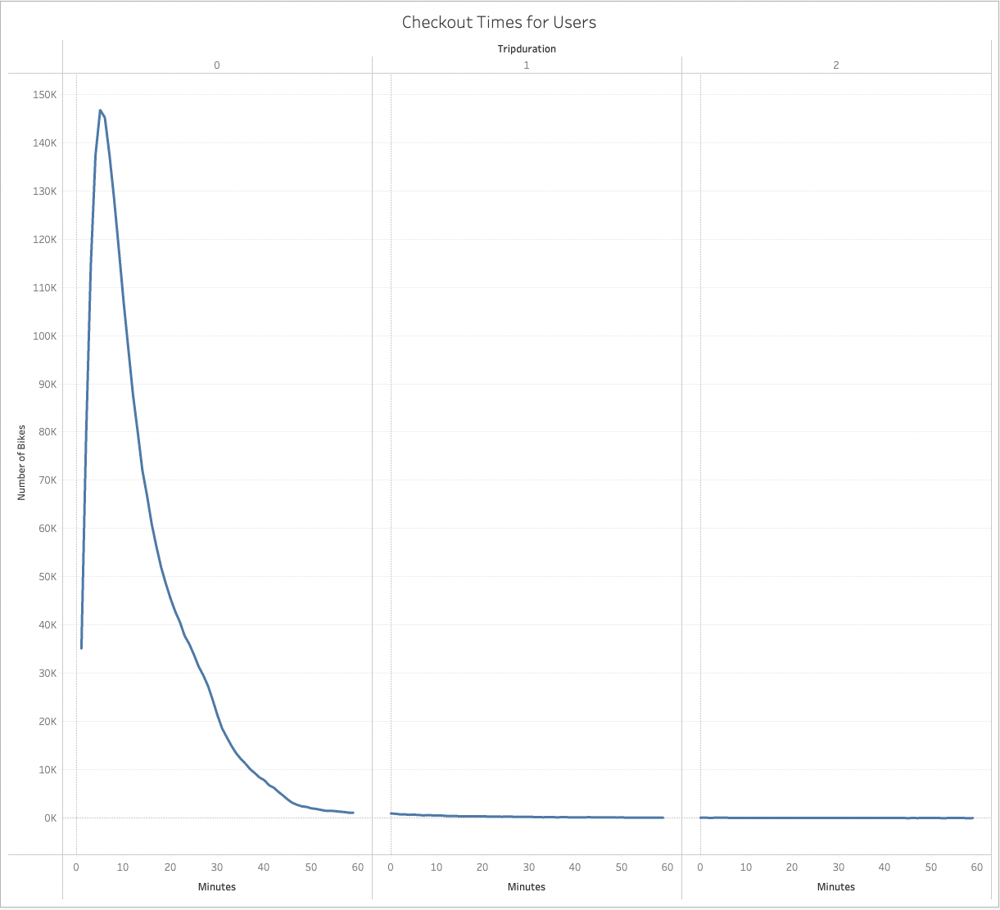
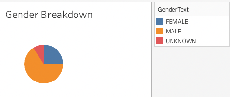
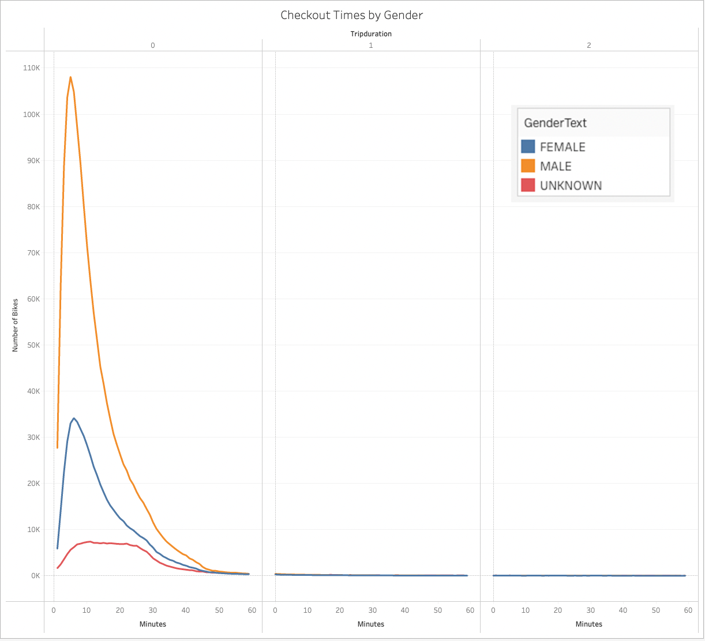
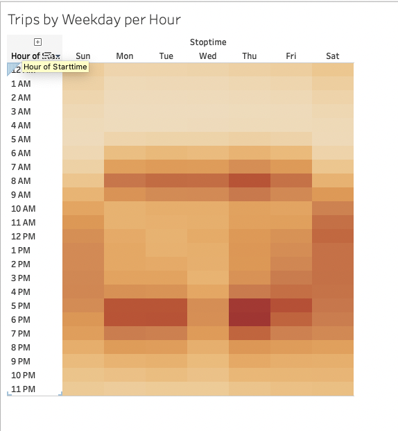
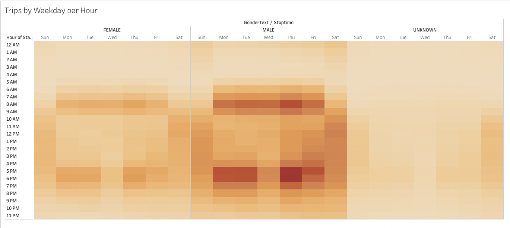
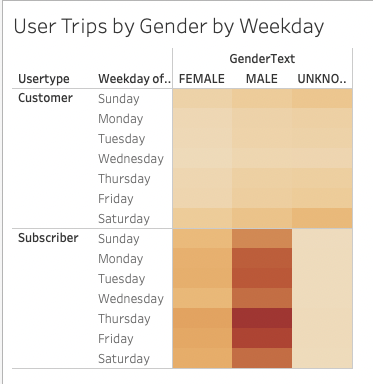

# Bikesharing Overview
The purpose of this project it to examine Citibike data from NYC to see how it informs the decision to start a bike sharing enterprise in Des Moines, IA.  A variety of visulazations have been created in Tableau to illustrate user behavior.  Those results are available in this [Tableau story](https://public.tableau.com/app/profile/kyle.johnson3941/viz/bikesharing_challenge_16439516176010/Story1?publish=yes).

# Results
### Bike Utilization
This image shows the total time each bike has been used and has implications for equipment replacment as well as maintenance.  In NYC Citybike sees relatively even distribtuion of usage across units.  A few bikes will need significantly more maitenance than the others.

### Times - All Users
This graph shows the count of rentals for each checkout duration.  The line peaks at 5 minutes, meaning this is the most common rental period.  
 

### Gender Breakdown
The gender breakdown graph shows that men represent the majority of users.
 

### Times by Gender
This is the same plot as the previous graph, but grouped by gender.  It shows that men are the predominate users, but that rental period across gender is similar, with the peak rental period for women being just slight shorter than men.
 

### Trips by Weekday per Hour
This graph shows the number of trips by day and hour.  The darker bands around 8am and 5pm on Monday thru Friday show that trips are most fequent before and after work.  Saturday and Sunday show more even usage.  
 

### Trips by Weekday per Hour by Gender
This plot shows similar usage patterns across gender, with most trips occuring on weekdays before and after work for both genders.
 

### Trips by Gender by Weekday and User Type
This graph shows similar daily usage across gender.  It does show a difference in Customer vs Subscriber usage, with subcriber usage peaking during the week and customer usage more even, but slightly higher on weekends.  
 

# Summary
The results show that males make up the majority of Citibike users in NYC, but that usage patterns are similar for both genders aside from that.  The graphs show clear differences between subscribers and other customers.  In particular, subscribers seem to use Citibike for transportation to an from work.  This could be verified by creating a map that displays end locations, filterable by starting location.   The most common trips are short, around 5 minutes, suggesting that the majority of consumption will be people who live within a short bike ride of their place of employment. Therefore a map of Des Moines with a plot of work places vs housing density would help to show where the best locations for a bike share service would be.  
