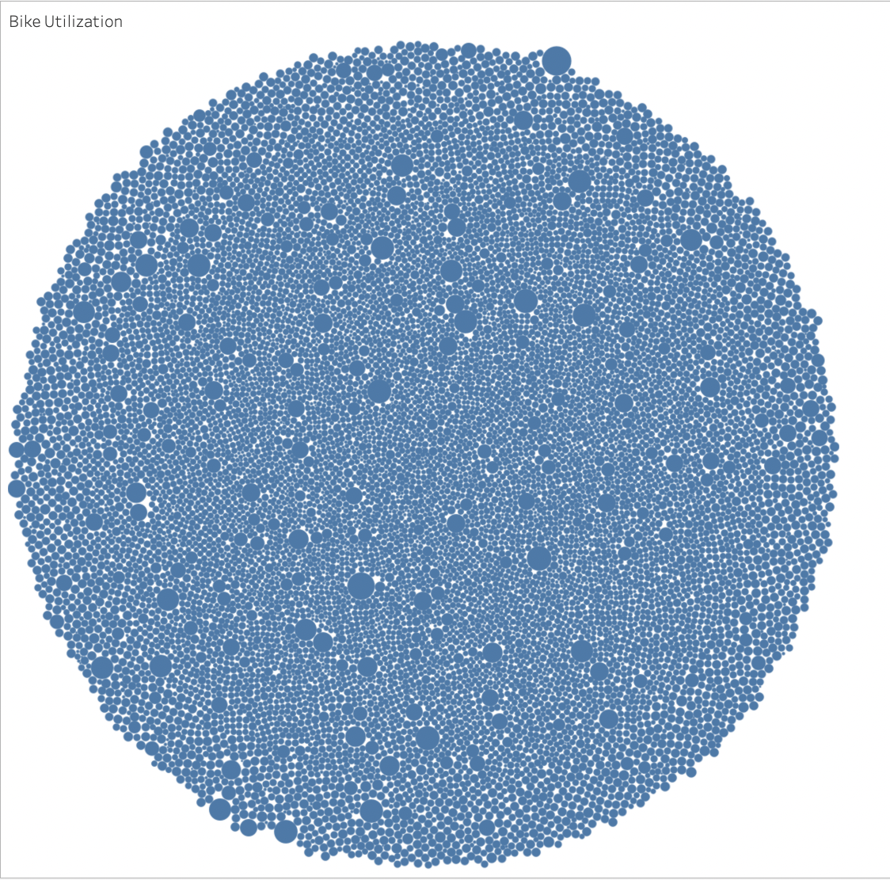

# Bikesharing Overview
The purpose of this project it to examine Citibike data from NYC to see how it informs the decision to start a bike sharing enterprise in Des Moines, IA.  A variety of visulazations have been created in Tableau to illustrate user behavior.  Those results are available in this [Tableau story](https://public.tableau.com/app/profile/kyle.johnson3941/viz/bikesharing_challenge_16439516176010/Story1?publish=yes).

# Results
### Bike Utilization
This image shows the total time each bike has been used and has implications for equipment replacment as well as maintenance.  In NYC Citybike sees relatively even distribtuion of usage across units.  A few bikes will need significantly more maitenance than the others.

### Title
Explain...
 

### Title
Explain...
 

### Title
Explain...
 

### Title
Explain...
 

### Title
Explain...
 

### Title
Explain...
 

# Summary

